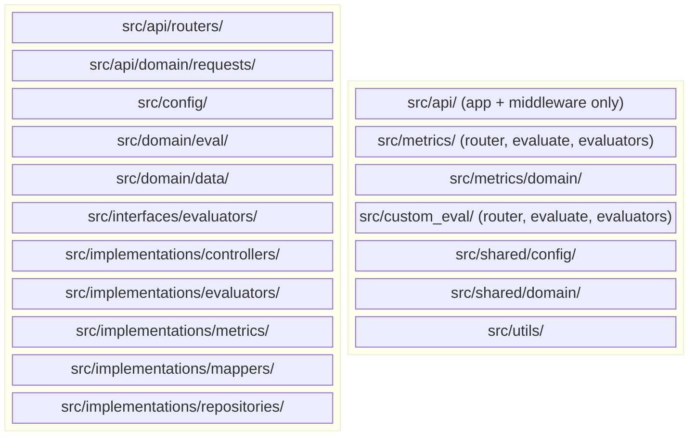
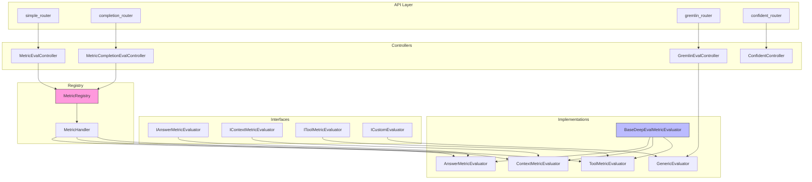
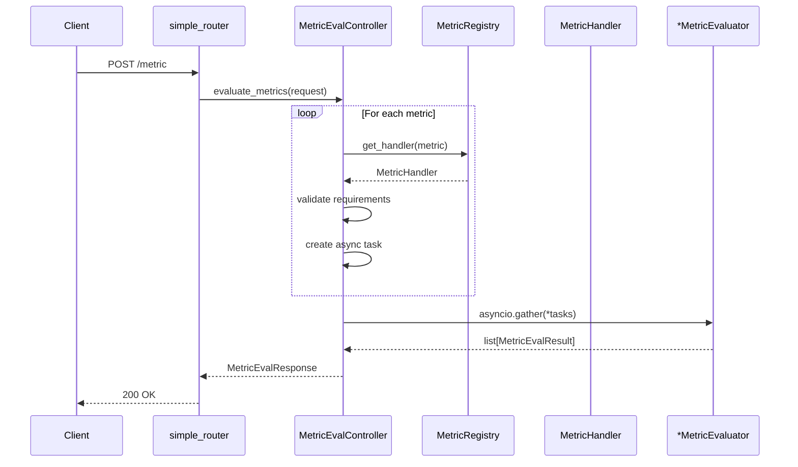
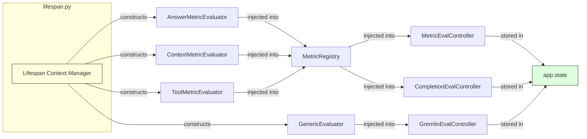
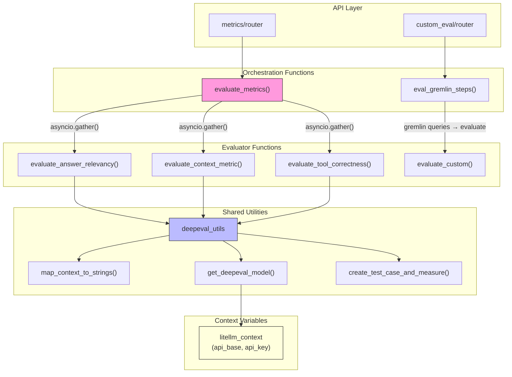
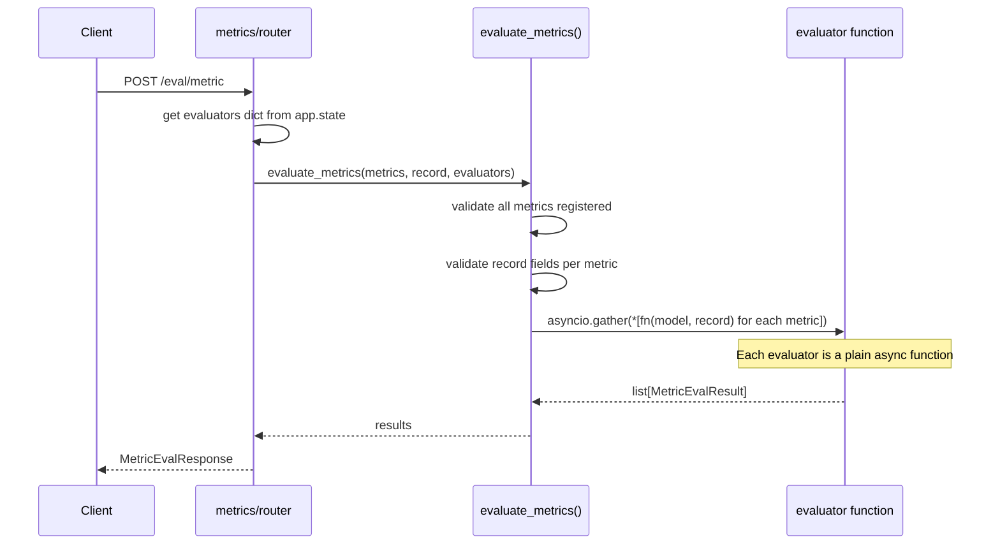
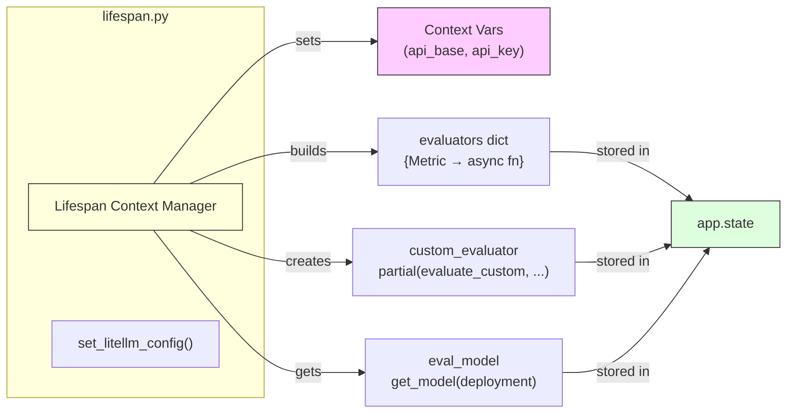
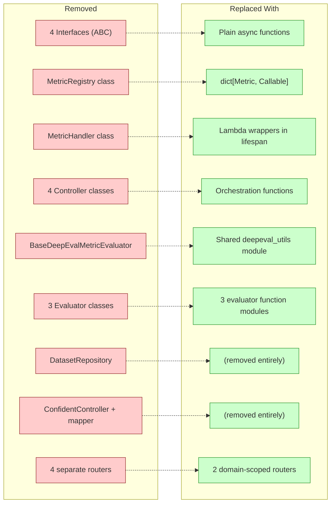

# ai_observability: Refactor to Functional Architecture

Branch `AI-fix-eval-code` restructures the entire `ai_observability` project from a class-based OOP architecture (interfaces, controllers, registry) to a functional architecture with plain functions, partials, and dict-based dispatch.

## Old vs New Directory Structure

**Key change:** Organised by feature domain (`metrics/`, `custom_eval/`) instead of by architectural layer (`interfaces/`, `implementations/`).

## Old Architecture — Class-Based

### Old Request Flow (Metric Evaluation)

### Old Dependency Injection

## New Architecture — Functional

### New Request Flow (Metric Evaluation)

### New Dependency Injection

## What Changed — Summary

## Endpoint Changes

| Old Endpoint | New Endpoint | Notes |
|---|---|---|
| `POST /metric` | `POST /eval/metric` | Same logic, functional orchestration |
| `POST /with_completion/metric` | `POST /eval/with_completion/metric` | Now uses `eval_with_completion()` |
| `POST /gremlin/custom` | `POST /eval/gremlin/custom` | Moved to `custom_eval/` module |
| `POST /confident` | *(removed)* | Confident integration dropped |

## Net Impact

- **-1422 lines** deleted, **+1267 lines** added (net **-155 lines**)
- 4 interfaces, 4 controllers, 1 registry, 1 base class → plain functions + a dict
- Organisation shifted from architectural layers to feature domains
- Context variables replace constructor-injected config
- `functools.partial` replaces class instantiation for DI

## Related

- [[2026-03-24 Refactor ai_observability to functional patterns]]
