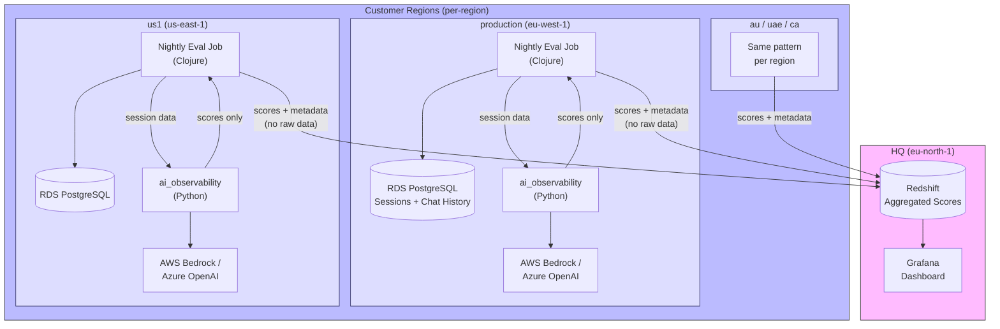
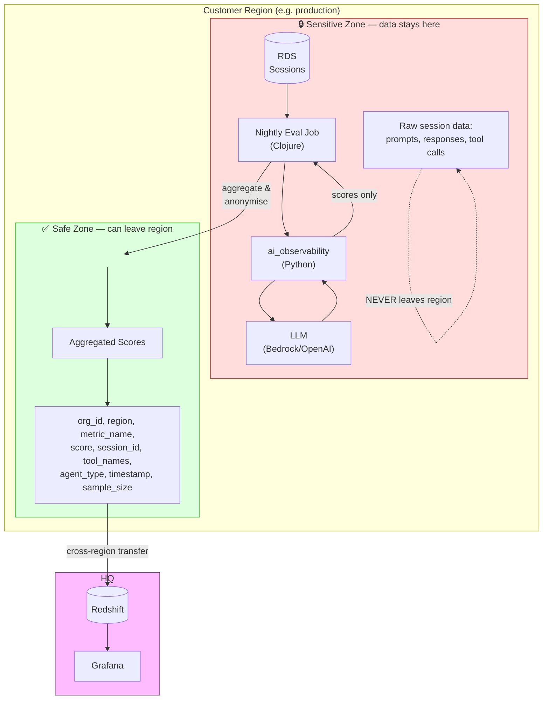
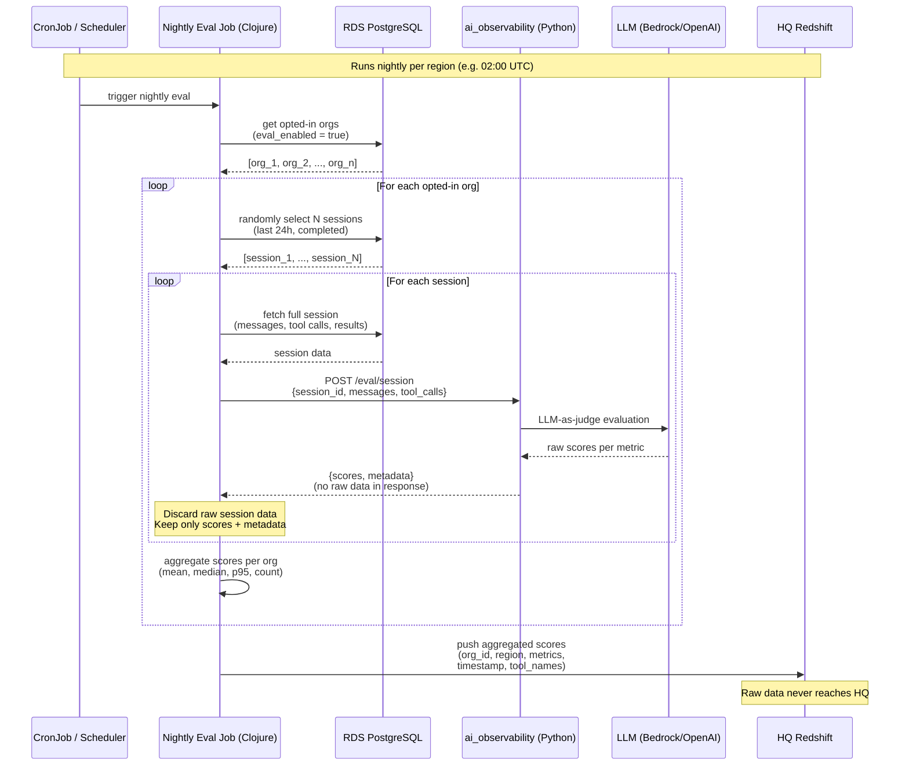
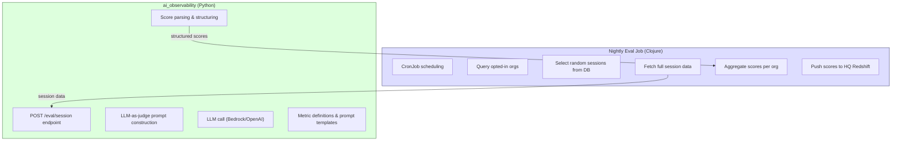
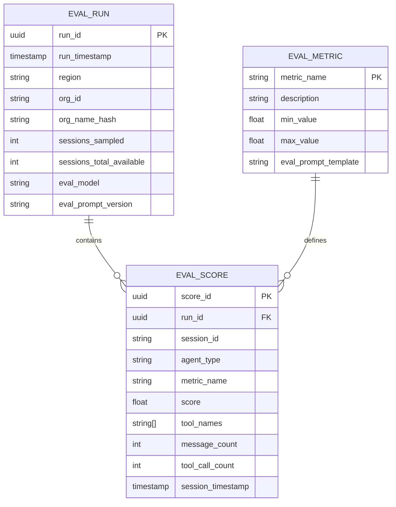
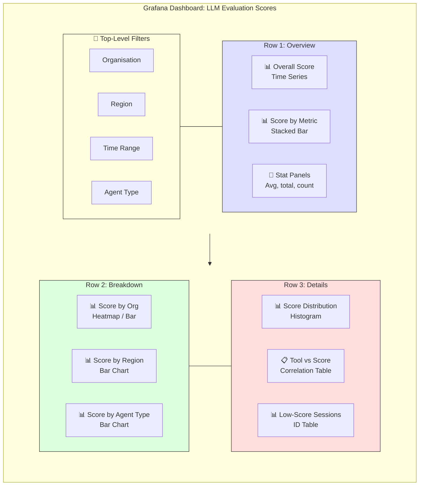
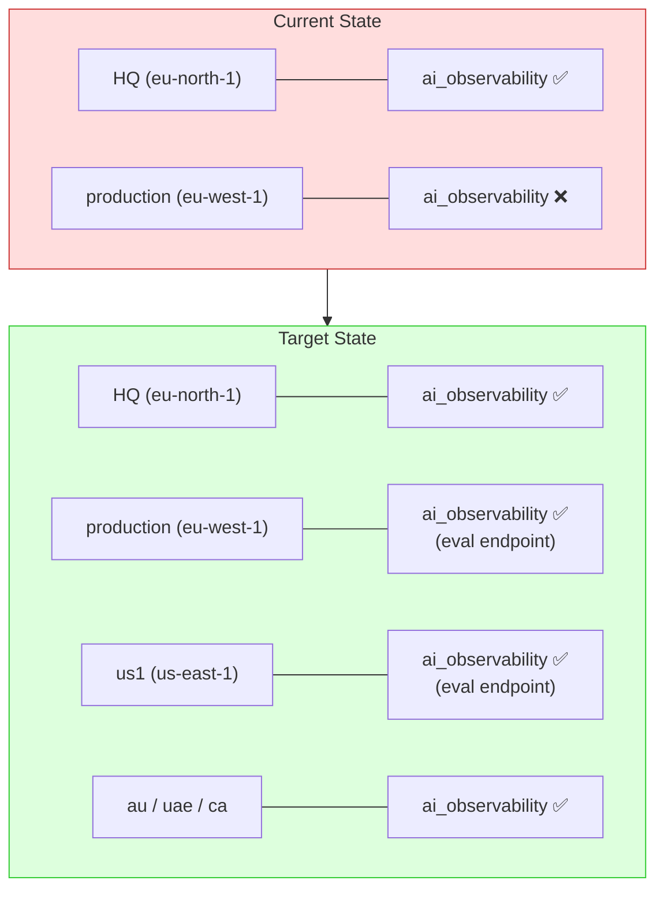

# LLM Evaluation Pipeline - Visual Guide

## 1. High-Level System Overview

## 2. Privacy Boundary — Data Flow

## 3. Nightly Job Sequence

## 4. Component Responsibilities

## 5. Data Model — What Gets Stored

## 6. Grafana Dashboard Layout

## 7. Deployment: ai_observability In-Region

