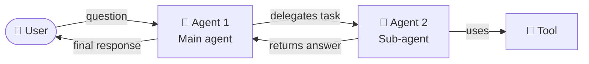
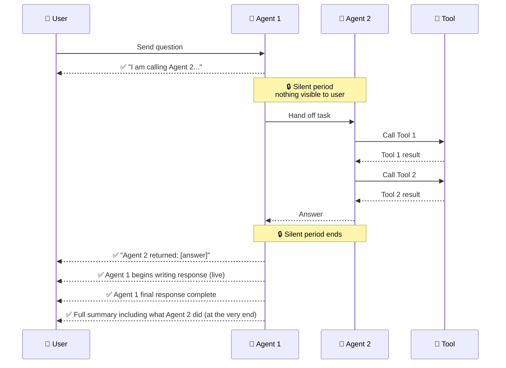
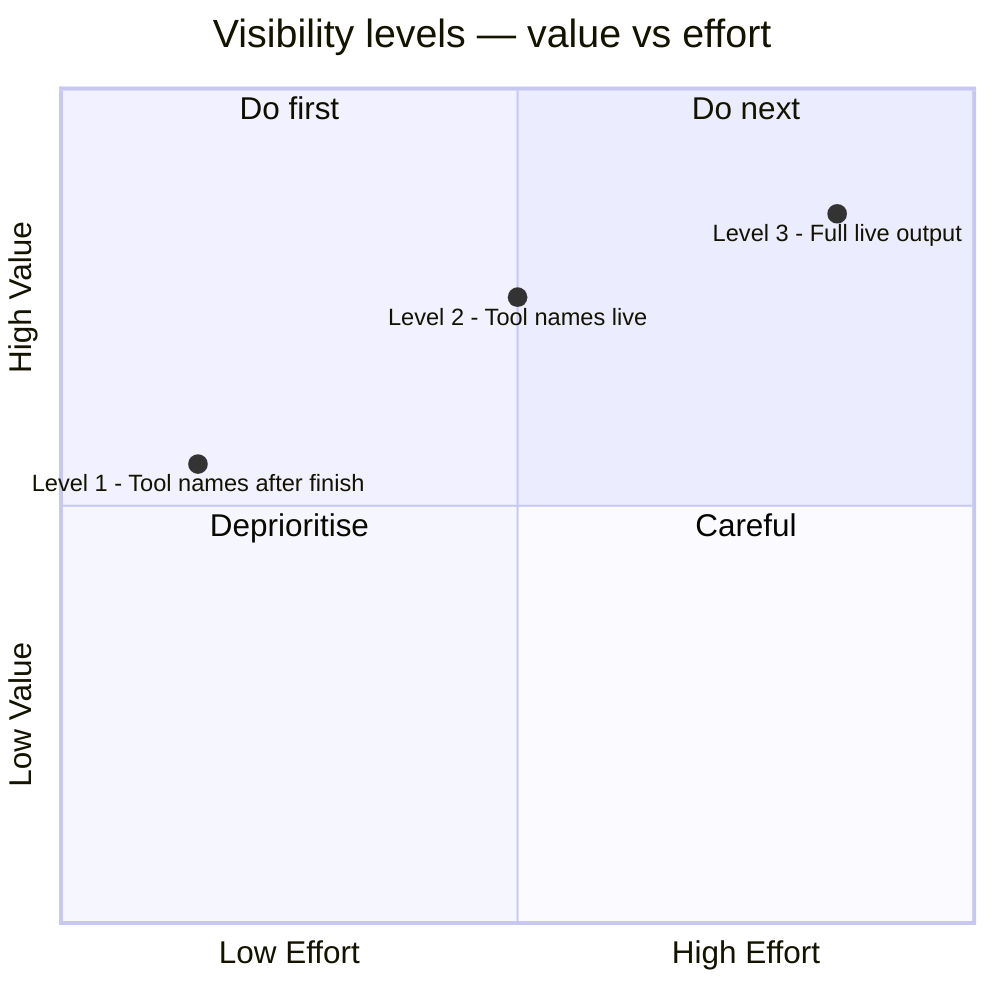

# Sub-agent visibility — what we can and cannot see in real time

This document explains what information is available to an end user when one AI agent calls another, and what it would take to make more of that activity visible live.

---

## Background — agents calling other agents

Our AI system is built around **agents**: specialised workers that receive a question, think, use tools, and return an answer. Some agents are complex enough that they delegate parts of their work to other, more specialised agents — **sub-agents**.

Think of it like a manager (Agent 1) who receives a request, decides part of the work is best handled by a specialist (Agent 2), hands it off, waits for the result, and then uses that result to form their final answer.

---

## What we can see today — the live window

When a user sends a request, the system streams events back in real time. Here is exactly what is visible and when.

### What the user actually receives, step by step

| # | What the user sees | When |
|---|---|---|
| 1 | ✅ Agent 1 is calling Agent 2 | Immediately |
| 2 | 🔒 *Nothing* | While Agent 2 is working |
| 3 | ✅ Agent 2 finished — here is what it returned | When Agent 2 completes |
| 4 | ✅ Agent 1's response, word by word | As Agent 1 writes it |
| 5 | ✅ Full trace of what Agent 2 did internally | Only at the very end |

---

## The locked window

The silence in step 2 is not an oversight — it is a fundamental constraint of how the underlying framework works.

When Agent 1 hands off to Agent 2, Agent 1 **stops and waits**. It cannot report anything to the user while it is waiting. It is like watching a manager pick up the phone to call a specialist — you see them dial, and you see them hang up, but while the call is in progress the door is closed.

```mermaid
gantt
    title What the user sees on their screen (timeline)
    dateFormat  ss
    axisFormat %Ss

    section Visible to user
    Agent 1 calls Agent 2          :milestone, m1, 00, 0s
    🔒 Silent — Agent 2 working    :crit, silent, 00, 6s
    Agent 2 result received         :milestone, m2, 06, 0s
    Agent 1 writes response (live)  :active, response, 06, 4s
    Full trace arrives              :milestone, m3, 10, 0s
```

During that silent period, Agent 2 may be:
- Calling one or more tools
- Thinking and reasoning
- Generating its own streamed response internally

None of this is visible. From the user's perspective it is a black box for the duration of Agent 2's work.

---

## What would it take to unlock visibility?

There are three levels of visibility we could aim for, each with increasing effort.

### Level 1 — Show what Agent 2 did, after it finishes ✅ low effort

After Agent 2 completes, replay the names of the tools it called just before showing the user Agent 2's result. The user sees the activity trace with a slight delay, but in the right order.

**What it looks like to the user:**
> Agent 1 called Agent 2 → *[a moment later]* → Agent 2 called: `fetch_data`, `summarise` → Agent 2 finished → Agent 1 responds...

**Effort:** Small. Requires adding roughly 10 lines to the streaming layer. No architectural change.

---

### Level 2 — Show Agent 2's tool calls as they happen ⚠️ medium effort

The names of tools that Agent 2 calls appear on the user's screen in real time — the moment Agent 2 calls them, not after it finishes.

**What it looks like to the user:**
> Agent 1 called Agent 2 → `fetch_data` called... → `fetch_data` done → `summarise` called... → `summarise` done → Agent 2 finished → Agent 1 responds...

**Effort:** Medium. Requires restructuring how the streaming layer runs — Agent 1's processing must be moved into a background worker so that Agent 2 can report events through a shared channel while Agent 1 is waiting. The information being streamed (tool names) is simple; the plumbing to make it real-time is not.

---

### Level 3 — Show Agent 2's full live output ⚠️⚠️ high effort

Everything Agent 2 produces — its reasoning, its tool calls, its partial responses — streams to the user word by word, interleaved with Agent 1's own output.

**What it looks like to the user:**
> Agent 1 called Agent 2 → `fetch_data` called... → `fetch_data` returned [data] → Agent 2 thinking: "The data shows..." → Agent 2 done → Agent 1 responds...

**Effort:** High. Same architectural change as Level 2, plus: managing continuous delta events from multiple agents simultaneously, debouncing, partial output state, and ensuring errors in one agent do not corrupt the other's stream.

---

## Summary

| Level | What the user sees live | Effort |
|---|---|---|
| **Today** | Agent 1 activity only. Sub-agent is a black box. | — |
| **Level 1** | Sub-agent tool names, shown just after it finishes | Low |
| **Level 2** | Sub-agent tool names, shown as they happen | Medium |
| **Level 3** | Sub-agent full output, interleaved live | High |

The current recommendation is to treat **Level 1** as a near-term improvement and revisit **Level 2** only if real-time sub-agent activity becomes a clear user need.
