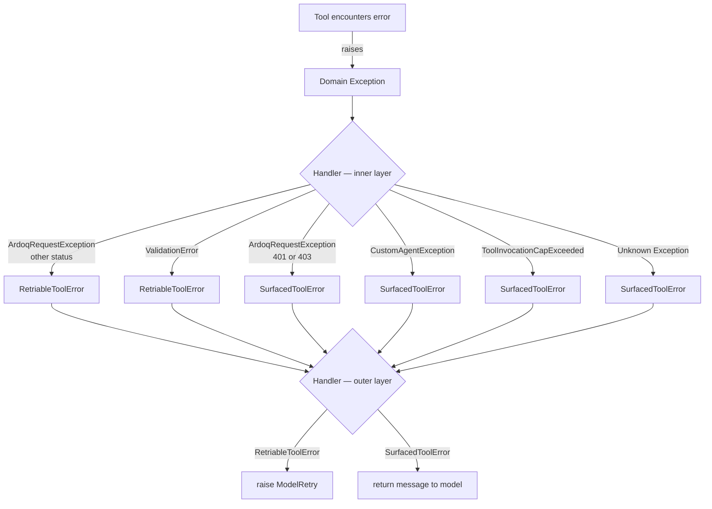

---
tags:
  - ai-1286
  - error-handling
  - design
type: work
status: done
---

# AI-1286 — Approach 1: Domain Errors + Handler Classification

Tools raise descriptive, domain-specific exceptions. The handler is responsible for classifying them into retry vs. surface semantics.

## Core Idea

Tools have no knowledge of `RetriableToolError` or `SurfacedToolError`. They raise whatever is semantically correct for their domain (`ArdoqRequestException`, `ValidationError`, etc.). The `tool_error_handler` owns the full classification table and wraps everything into one of the two outcome types before dispatching.

## Flow



## Code Shape

```python
# tools/exceptions.py
class RetriableToolError(Exception):
    def __init__(self, message: str, cause: Exception) -> None:
        self.cause = cause
        self.model_message = f"{message}: {cause}"
        super().__init__(self.model_message)

class SurfacedToolError(Exception):
    def __init__(self, message: str, cause: Exception) -> None:
        self.cause = cause
        self.model_message = f"{message}: {cause}"
        super().__init__(self.model_message)
```

```python
# tools/error_handling.py
async def wrapper(context, *args, **kwargs):
    try:
        try:
            return await func(context, *args, **kwargs)
        except ModelRetry:
            raise
        except (CustomAgentException, ToolInvocationCapExceeded) as e:
            raise SurfacedToolError(e.message, e)
        except ArdoqRequestException as e:
            if e.status_code in {401, 403}:
                raise SurfacedToolError(f"API error {e.status_code}", e)
            raise RetriableToolError(f"API error {e.status_code}", e)
        except ValidationError as e:
            raise RetriableToolError("Validation failed", e)
        except Exception as e:
            raise SurfacedToolError(f"Unexpected error ({type(e).__name__})", e)

    except RetriableToolError as e:
        logger.warning(f"Retriable error in {func.__name__}", cause=str(e.cause))
        raise ModelRetry(e.model_message)
    except SurfacedToolError as e:
        logger.warning(f"Surfaced error in {func.__name__}", cause=str(e.cause))
        return e.model_message
```

## Pros

- **Separation of concerns** — tools express what happened, the handler decides what to do about it
- **Domain exceptions are meaningful** — `ArdoqRequestException` with its `status_code`, `body` etc. is preserved as `.cause` and fully inspectable in logs
- **Classification is centralised** — one place owns the retry/surface table; tools need no awareness of it
- **Easier to test classification in isolation** — the mapping logic is a pure function of exception type + attributes
- **Future-proof** — new domain exception types only require a new branch in the handler, not changes across all tools

## Cons

- **Handler must know all exception types** — it imports from `tools/`, `agents/custom/`, `api/`, `pydantic` etc.; any new exception source needs a handler update
- **Two-layer try/except** — the nested structure is non-obvious and requires a comment to explain the intent
- **Classification can drift** — if a new exception is added to the codebase but not to the handler, it silently falls to the catch-all (surface by default, which is safe, but unintentional)

## Related

- [[Clients/Ardoq/AgentNotes/Active/2026-06-10 AI-1286 Approach 2 - Raise at Source]]
- [[Clients/Ardoq/AgentNotes/Archive/2026-04-21 Pi.dev Claude Code API Key 429 Error Investigation]]
