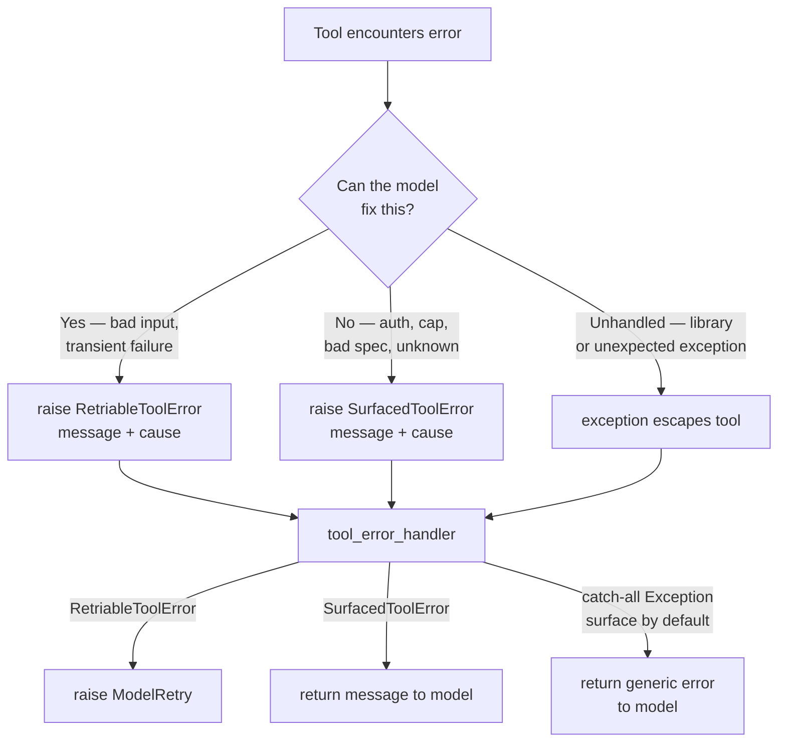

---
tags:
  - ai-1286
  - error-handling
  - design
type: work
status: done
---

# AI-1286 — Approach 2: Raise at Source

Tools raise `RetriableToolError` or `SurfacedToolError` directly. The handler is a trivial dispatcher with no classification logic.

## Core Idea

The retry/surface decision is made at the throw site — inside the tool itself. Domain exceptions are caught locally, wrapped with a message and the original cause, and raised as one of the two outcome types. The handler sees only `RetriableToolError` or `SurfacedToolError` and dispatches accordingly.

## Flow



## Code Shape

```python
# tools/exceptions.py — same two classes as Approach 1
class RetriableToolError(Exception):
    def __init__(self, message: str, cause: Exception) -> None:
        self.cause = cause
        self.model_message = f"{message}: {cause}"
        super().__init__(self.model_message)

class SurfacedToolError(Exception):
    def __init__(self, message: str, cause: Exception) -> None:
        self.cause = cause
        self.model_message = f"{message}: {cause}"
        super().__init__(self.model_message)
```

```python
# Inside a tool — decision made at throw site
async def some_tool(context, ...):
    try:
        return await ardoq_request(...)
    except ArdoqRequestException as e:
        if e.status_code in {401, 403}:
            raise SurfacedToolError(f"API error {e.status_code}: unauthorised", e)
        raise RetriableToolError(f"API error {e.status_code}", e)
```

```python
# tools/error_handling.py — trivially simple
async def wrapper(context, *args, **kwargs):
    try:
        return await func(context, *args, **kwargs)
    except ModelRetry:
        raise
    except RetriableToolError as e:
        logger.warning(f"Retriable error in {func.__name__}", cause=str(e.cause))
        raise ModelRetry(e.model_message)
    except SurfacedToolError as e:
        logger.warning(f"Surfaced error in {func.__name__}", cause=str(e.cause))
        return e.model_message
    except Exception as e:
        # Unclassified — surface by default (safe fallback)
        logger.exception(f"Unclassified error in {func.__name__}")
        return f"Unexpected error ({type(e).__name__}): {e}"
```

## Debugging Comparison

Both approaches preserve `.cause` on the wrapper exception, but the loss in Approach 2 happens earlier — at the throw site inside the tool. In Approach 1 the full domain object (e.g. `ArdoqRequestException` with its `status_code` and `body`) flows all the way to the handler before being wrapped.

```mermaid
flowchart LR
    subgraph Approach 1
        A1[ArdoqRequestException\nstatus_code=422\nbody={errors}] -->|arrives intact| H1[Handler]
        H1 -->|wraps into| W1[RetriableToolError\n.cause = full exception]
    end

    subgraph Approach 2
        A2[ArdoqRequestException\nstatus_code=422\nbody={errors}] -->|caught in tool| T2[Tool]
        T2 -->|wraps into| W2[RetriableToolError\n.cause = full exception]
        W2 -->|arrives| H2[Handler]
    end
```

The structured data is still available via `.cause` in both cases — the difference is that in Approach 2 the tool author decides what message to attach, whereas in Approach 1 the handler controls the message uniformly.

## Pros

- **Handler is trivially simple** — three branches, no imports from domain modules, easy to test exhaustively
- **Classification is co-located with context** — the tool knows why it's raising; the message can be richer and more specific than a generic handler could produce
- **No classification drift** — there is no central table to forget to update; each tool handles its own errors
- **`.cause` preserves the original exception** — debugging loss is limited

## Cons

- **Classification logic is scattered** — every tool that can fail must make the retry/surface call; consistency relies on discipline, not structure
- **Tools are coupled to handler semantics** — `RetriableToolError` / `SurfacedToolError` are infrastructure concepts leaking into domain logic
- **Harder to change the taxonomy** — if the retry/surface split changes (e.g. a new default), every throw site must be audited
- **Unclassified exceptions still need a catch-all** — any exception not explicitly wrapped (e.g. from a library) still reaches the handler untyped

## Related

- [[Clients/Ardoq/AgentNotes/Active/2026-06-10 AI-1286 Approach 1 - Domain Errors]]
- [[Clients/Ardoq/AgentNotes/Archive/2026-04-21 Pi.dev Claude Code API Key 429 Error Investigation]]
