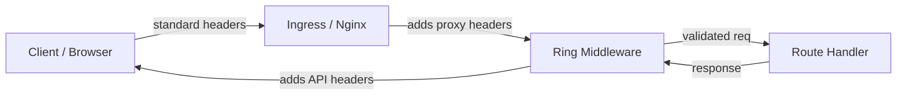
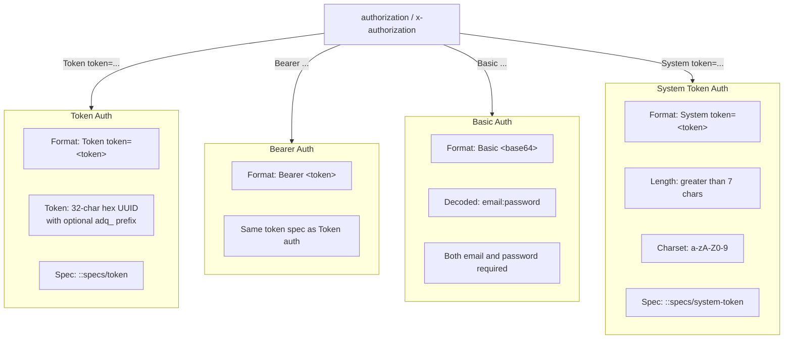
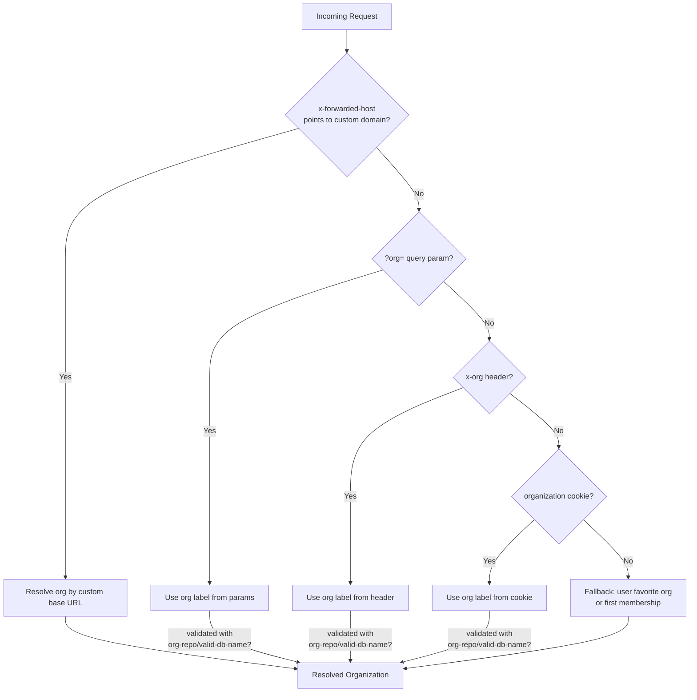
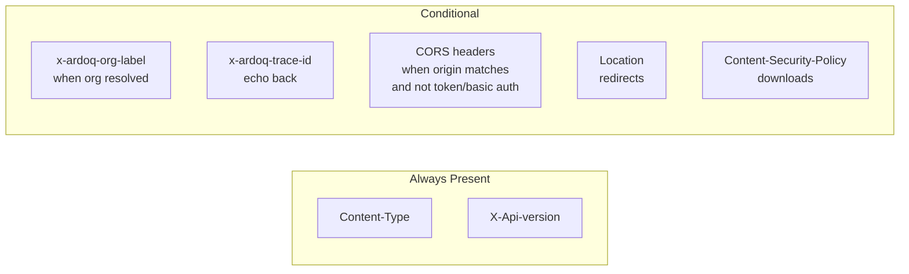
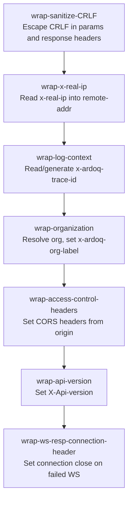

# API Request Headers

Complete reference for HTTP headers used by the Ardoq API backend (`ardoq-api`).

## Request Flow Overview

**Ingress adds:** x-forwarded-host, x-ardoq-nonce, x-ardoq-geoip-*, x-real-ip, x-ardoq-trace-id

**Middleware adds to response:** X-Api-version, x-ardoq-org-label, x-ardoq-trace-id, CORS headers

## Authentication Headers

### Details

| Header            | Values                                                             | Validation        | Source |
| ----------------- | ------------------------------------------------------------------ | ----------------- | ------ |
| `authorization`   | `Token token=<t>`, `Bearer <t>`, `Basic <b64>`, `System token=<t>` | See diagram above | Client |
| `x-authorization` | Same as `authorization` (fallback)                                 | Same              | Client |

**Token format**: 32-char hex string (UUID without hyphens), optionally prefixed with `adq_`.
**System token**: Alphanumeric string, >7 chars. No base64 (no padding chars).
**Basic auth**: Base64-encoded `email:password`. Both parts must be non-blank.

## Organization Resolution

| Header | Format | Validation | Source |
|---|---|---|---|
| `x-org` | Org label string | `org-repo/valid-db-name?` | Client |
| `x-forwarded-host` | Hostname (no port) | Matched against org custom domains | Ingress/Nginx |

## Ingress-Injected Headers

These headers are set by the ingress controller (Nginx/load balancer), not by clients.

| Header | Format | Purpose | Used In |
|---|---|---|---|
| `x-forwarded-host` | Hostname | Custom domain routing | `request_utils/host-from-req` |
| `x-real-ip` | IP address | Real client IP behind proxy | `middleware/wrap-x-real-ip` |
| `x-ardoq-nonce` | Unique string | CSP nonce for script tags | `request_utils/csp-nonce`, SAML |
| `x-ardoq-geoip-city` | City name | GeoIP city | `request_utils/geoip-city` |
| `x-ardoq-geoip-region` | Region name | GeoIP region | `request_utils/geoip-region` |
| `x-ardoq-geoip-country` | Country name | GeoIP country | `request_utils/geoip-country` |
| `x-ardoq-trace-id` | UUID | Distributed tracing | `middleware/wrap-log-context` |

**Note**: `x-ardoq-trace-id` can also be provided by clients — middleware validates it as UUID and generates one if missing or invalid.

## Standard Headers

| Header | Purpose | Used In |
|---|---|---|
| `host` | Request host (dev/ngrok only) | `request_utils/ngrok-dev-host-header` |
| `origin` | CORS origin checking | `middleware/wrap-access-control-headers` |
| `content-type` | JSON body detection | `middleware/content-type-json?` |
| `user-agent` | Client identification & tracking | `middleware/wrap-tracking-context` |
| `accept-language` | Language preference | `middleware/primary-accepted-language` |
| `sentry-trace` | Sentry distributed tracing | OpenTelemetry capture |

## Response Headers

| Header | Value | Condition |
|---|---|---|
| `Content-Type` | `application/json;charset=UTF-8` or `text/plain;charset=UTF-8` | Always |
| `X-Api-version` | Version string | Always (via `wrap-api-version`) |
| `x-ardoq-org-label` | Org label | When org is resolved |
| `x-ardoq-trace-id` | UUID | Always (generated or echoed) |
| `access-control-allow-origin` | Origin URL | When CORS origin is whitelisted and not token/basic auth |
| `access-control-allow-credentials` | `"true"` | With CORS |
| `access-control-allow-headers` | `"content-type"` | With CORS |
| `vary` | `"Origin"` | With CORS |
| `Content-Security-Policy` | Restrictive CSP | Downloads only |
| `Content-Disposition` | `attachment; filename="..."` | Downloads only |
| `Location` | URL | Redirects (custom domain, missing org, choose org) |
| `WWW-Authenticate` | `Token realm="Ardoq"` | 401 responses |
| `connection` | `"close"` | Failed WebSocket upgrades |

## Middleware Pipeline (Header-Relevant)

## Key Source Files

- `src/ardoq/utils/request_utils.clj` — Header reading, auth parsing, CORS
- `src/ardoq/middleware.clj` — Middleware that reads/writes headers
- `src/ardoq/utils/org_resolver.clj` — Org resolution from headers/cookies/params
- `src/ardoq/specs.clj` — Token and system-token specs
- `src/ardoq/auth/api.clj` — Auth handlers using parsed tokens
