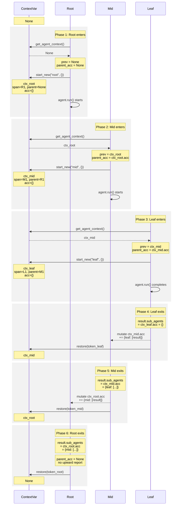

# AgentContext Lifecycle in `run_completion`

Visual reference for how `AgentContext` instances are created, read, mutated, and restored across nested `run_completion` calls.

## Key Concepts

- **`_agent_context`**: A `ContextVar` holding the currently active `AgentContext | None`
- **`AgentContext`**: Frozen Pydantic model with `agent_name`, `span_id`, `parent_span_id`, and a mutable `accumulator` dict
- **`accumulator`**: A `dict[str, list[CompletionSuccess | CompletionFailure]]` — mutated in-place by child agents to report results upward
- Each `run_completion` call creates its own `AgentContext` with a fresh empty accumulator

## Sequence: 3-Layer Nested Agent Run

Example: `root_agent` calls `mid_agent` via a tool, which calls `leaf_agent` via a tool.

**Participants:** CV = `_agent_context` ContextVar, R/M/L = `run_completion` for root/mid/leaf agent.

## State Table

Shows the `_agent_context` ContextVar value and each accumulator's contents at each phase boundary.

| Phase | `_agent_context` | `ctx_root.acc` | `ctx_mid.acc` | `ctx_leaf.acc` |
|-------|-----------------|----------------|---------------|----------------|
| Before root enters | `None` | — | — | — |
| Root enters | `ctx_root` | `{}` | — | — |
| Mid enters | `ctx_mid` | `{}` | `{}` | — |
| Leaf enters | `ctx_leaf` | `{}` | `{}` | `{}` |
| Leaf exits | `ctx_mid` | `{}` | `{"leaf": [...]}` | `{}` |
| Mid exits | `ctx_root` | `{"mid": [...]}` | `{"leaf": [...]}` | `{}` |
| Root exits | `None` | `{"mid": [...]}` | `{"leaf": [...]}` | `{}` |

## Key Observations

1. **Each layer only sees direct children** — root's accumulator has `mid_agent` but not `leaf_agent`. The nested structure is preserved inside `mid_agent`'s result via `sub_agents`.

2. **Accumulator mutation crosses context boundaries** — when leaf exits, it mutates `ctx_mid.accumulator` even though `ctx_mid` is frozen. This works because frozen only prevents field reassignment, not dict mutation.

3. **`parent_accumulator` is captured before context switch** — line 61-62 reads the *previous* context's accumulator, then line 63 creates a new context. This is what links child results to the correct parent.

4. **Restore is in `finally`** — context is always restored even on exception, preventing context leaks.

---

*Source: `ardoq_ai/completion/non_streaming.py`, `ardoq_ai/completion/span_context.py`*
