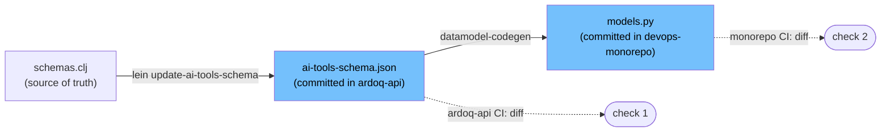

# AI-1026 — Implementation Plan

Concrete implementation plan for the committed-artifact approach (Approach 1). For background, dependency analysis, and approach comparison see [[Clients/Ardoq/AgentNotes/Reference/Development/2026-06-22 AI-1026 Pydantic Model Sync CI Approaches|AI-1026 Pydantic Model Sync CI Approaches]].

## Design

- **Source of truth:** `schemas.clj` malli schemas in ardoq-api.
- **Committed artifact:** `ardoq-api/resources/ai-tools-schema.json` (generated from the schemas, committed).
- **Two independent checks (check-only, never write in CI):**
  - ardoq-api CI: committed JSON matches freshly generated JSON.
  - devops-monorepo CI: committed `models.py` matches models generated from the committed JSON.
- **Generation happens locally by developers**, not in CI. CI only verifies.



## ardoq-api changes

### 1. `schema_codegen.clj` — `-main` (✅ done)

Added `-main` that serialises `generate` output to JSON on stdout. Loads full classpath but never starts the component system / DB.

### 2. `project.clj` — alias

```clojure
:aliases {"update-ai-tools-schema" ["run" "-m" "ardoq.ai-tools.schema-codegen"]}
```

Developer regen command:
```bash
lein update-ai-tools-schema > resources/ai-tools-schema.json
```

### 3. `resources/ai-tools-schema.json` — new committed artifact

### 4. `.github/workflows/build-and-test.yml` — new check job

```yaml
check-schema-artifact:
  name: Check Schema Artifact In Sync
  needs: build-cache
  runs-on: gha-ardoq-small
  steps:
    - uses: actions/checkout@v7
    - name: Restore lein dependencies
      uses: ardoq/ardoq-actions/restore-cache@v1.8.0
      with:
        key: ardoq-api-build-and-test-${{ runner.os }}-lein-${{ github.run_id }}-lein-deps
    - name: Generate schema
      run: lein -o update-ai-tools-schema > /tmp/schema-generated.json
    - name: Validate output
      run: |
        jq empty /tmp/schema-generated.json
        [ "$(jq '."$defs" | length' /tmp/schema-generated.json)" -gt 10 ] \
          || { echo "Schema output suspiciously small"; exit 1; }
    - name: Diff against committed artifact
      run: |
        diff resources/ai-tools-schema.json /tmp/schema-generated.json \
          || { echo "Out of sync. Run: lein update-ai-tools-schema > resources/ai-tools-schema.json"; exit 1; }
```

## devops-monorepo changes

### 5. `generate_models.sh` — UNTOUCHED

Existing live-API script kept as-is (no longer referenced by a moon task; retained for manual live-API generation). Optional rename to `generate_models_from_api.sh` only.

### 6. `sync_models.sh` — new unified script (`--check` flag)

One script. Always generates to a temp file, then either diffs (`--check`) or moves into place (default). No duplicated codegen.

- **default:** write `models.py`
- **`--check`:** verify only, write nothing, exit 1 on drift
- Requires `ARDOQ_API_SCHEMA_FILE` env var (path to the JSON).

Core logic:
```bash
CHECK_ONLY=false
[[ "${1:-}" == "--check" ]] && CHECK_ONLY=true
SCHEMA_FILE="${ARDOQ_API_SCHEMA_FILE:?must be set}"
# ... datamodel-codegen --input "$SCHEMA_FILE" --output "$TMP_MODELS" (same flags as before) ...
if [ "$CHECK_ONLY" = true ]; then
  diff "$COMMITTED_MODELS" "$TMP_MODELS" && { echo in-sync; exit 0; } || { echo "out of sync"; exit 1; }
fi
mv "$TMP_MODELS" "$COMMITTED_MODELS"
```
Reuses the exact `datamodel-codegen` flags + header from `generate_models.sh`.

### 7. `libs/ardoq_ai/moon.yml` — task updates

```yaml
tasks:
  generate-models:
    command: bash ardoq_ai/codegen/sync_models.sh
    # ARDOQ_API_SCHEMA_FILE provided by developer at call time
  check-models:
    command: bash ardoq_ai/codegen/sync_models.sh --check
    # ARDOQ_API_SCHEMA_FILE set by CI step before invoking
  update-model-info:
    command: bash ardoq_ai/codegen/update_model_info.sh
    env:
      LITE_LLM_ENDPOINT: https://llm-gateway.hq.ardoq.dev
```

### 8. `.github/workflows/lib-ardoq-ai.yml` — new CI workflow

```yaml
name: Check libs/ardoq_ai
on:
  pull_request:
    branches: [main, test]
    paths: [libs/ardoq_ai/**]
jobs:
  check-models:
    name: Check models.py in sync
    runs-on: ubuntu-latest
    steps:
      - uses: actions/checkout@v7
      - name: Checkout ardoq-api schema artifact
        uses: actions/checkout@v7
        with:
          repository: ardoq/ardoq-api
          token: ${{ secrets.ARDOQ_BOT_TOKEN }}
          sparse-checkout: resources/ai-tools-schema.json
          sparse-checkout-cone-mode: false
          path: ardoq-api
      - uses: moonrepo/setup-toolchain@v0
        with:
          moon-version: "2.1.0"
      - uses: astral-sh/setup-uv@v7
        with:
          version: "0.11.14"
      - run: uv sync --locked --all-extras --dev
      - name: Check models.py is in sync
        env:
          ARDOQ_API_SCHEMA_FILE: ${{ github.workspace }}/ardoq-api/resources/ai-tools-schema.json
        run: moon run ardoq_ai:check-models
```

## Files touched

| Repo | File | Change |
|---|---|---|
| ardoq-api | `project.clj` | Add `update-ai-tools-schema` alias |
| ardoq-api | `src/ardoq/ai_tools/schema_codegen.clj` | ✅ Done (`-main`) |
| ardoq-api | `resources/ai-tools-schema.json` | New committed artifact |
| ardoq-api | `.github/workflows/build-and-test.yml` | New `check-schema-artifact` job (uses alias) |
| devops-monorepo | `generate_models.sh` | Untouched (optional rename) |
| devops-monorepo | `sync_models.sh` | New unified generate/check (`--check`) |
| devops-monorepo | `libs/ardoq_ai/moon.yml` | Repoint `generate-models`, add `check-models` |
| devops-monorepo | `.github/workflows/lib-ardoq-ai.yml` | New CI check workflow |

## Risks / open items

1. **`generate-models` requires `ARDOQ_API_SCHEMA_FILE`** with no default — developer must point at their local ardoq-api checkout. Decide whether to document a conventional path.
2. **Exact-match diff is version-sensitive.** Local and CI must use identical `datamodel-code-generator` (pinned `0.56.1`) and ruff, else false failures. Enforce via locked deps.
3. **No cross-repo trigger.** A schemas.clj change won't fail monorepo CI until the next monorepo PR — inherent silent-staleness window (see approaches note).

## Related

- [[Clients/Ardoq/AgentNotes/Reference/Development/2026-06-22 AI-1026 Pydantic Model Sync CI Approaches]]
- `ardoq-api/src/ardoq/ai_tools/schema_codegen.clj`
- `devops-monorepo/libs/ardoq_ai/moon.yml`
