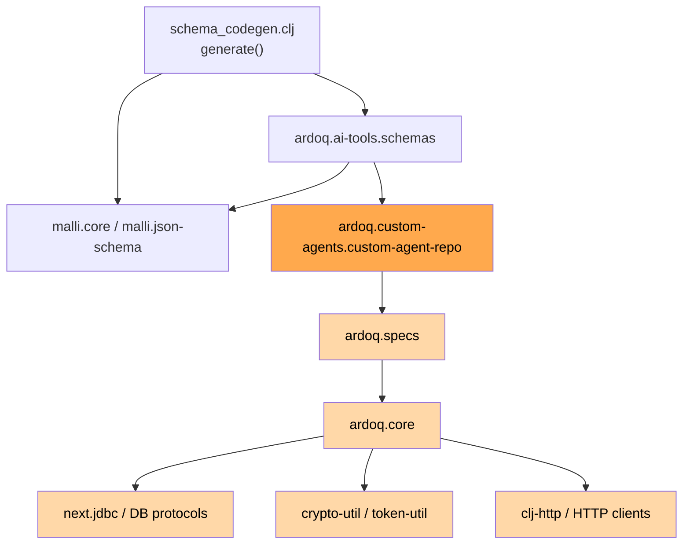
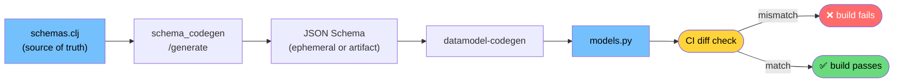
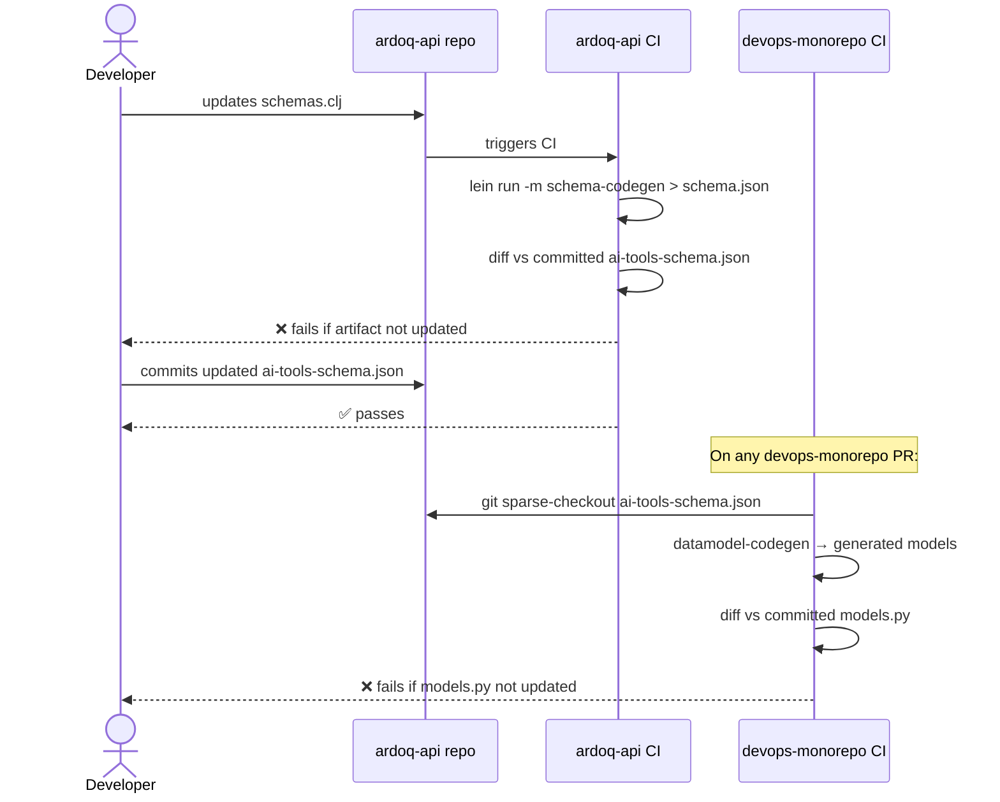
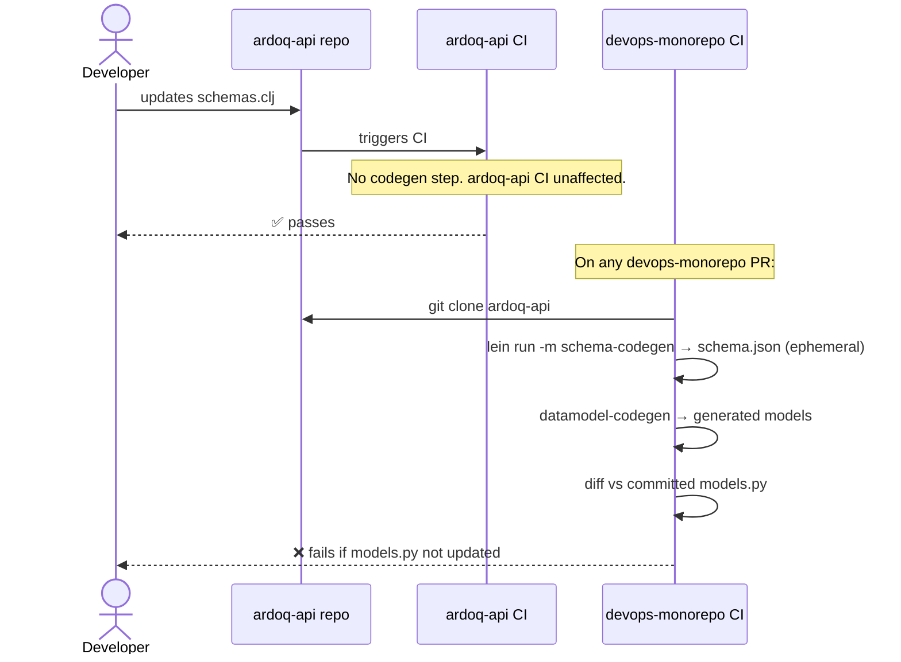

# AI-1026 — Pydantic Model Sync CI: Approaches

> [!info] Implementation plan
> This note covers background, dependency analysis, and approach comparison. For the concrete, chosen implementation plan (committed-artifact / Approach 1) see [[Clients/Ardoq/AgentNotes/Reference/Development/2026-06-22 AI-1026 Implementation Plan|AI-1026 Implementation Plan]].

## Overview

AI-1026 asks for a CI workflow that validates `models.py` (generated Pydantic v2 models in `devops-monorepo`) stays in sync with the Clojure malli schemas in `ardoq-api/src/ardoq/ai_tools/schemas.clj`.

Running the full API stack in CI is not feasible (requires Docker + the full ardoq bundle). The approach is to run `lein run -m ardoq.ai-tools.schema-codegen` directly — this loads the full classpath but does not start the component system, open any DB connections, or require any live infrastructure.

---

## The Dependency Chain (context only)

`schema_codegen/generate` loads the full ardoq-api classpath transitively:



**This is not a problem in practice.** `ardoq-api` uses Stuart Sierra's `component` library — DB connections and all stateful infrastructure are only started via an explicit `(component/start ...)` call. Loading the namespaces alone has no side effects. Verified locally: `lein run -m ardoq.ai-tools.schema-codegen` loads the full classpath and exits cleanly.

---

## The Codegen Command

A `-main` function was added to `schema_codegen.clj` (the only code change required in `ardoq-api`):

```clojure
(defn -main [& _]
  (println (json/generate-string (generate))))
```

This serialises the output of the existing `generate` function to JSON and prints to stdout. The generation command is:

```bash
lein run -m ardoq.ai-tools.schema-codegen > schema.json
```

Output validation before handing off to `datamodel-codegen`:

```bash
jq empty schema.json  # valid JSON
[ "$(jq '."$defs" | length' schema.json)" -gt 10 ] || { echo "Schema output too small"; exit 1; }
```

---

## The Drift Guard Chain



Drift is caught when the CI diff check runs — i.e., on any PR to devops-monorepo. Both approaches below share this property: there is no automated cross-repo trigger, so a Clojure schema change will not immediately fail the Python CI. The gap closes on the next devops-monorepo PR.

---

## CI Approach 1 — Committed Artifact

ardoq-api generates and commits `ai-tools-schema.json`. devops-monorepo CI fetches that file — no Clojure toolchain needed on the Python side.



**devops-monorepo CI needs:** git read access to `ardoq-api` + `datamodel-codegen`. No JVM.

---

## CI Approach 2 — Generate in Python CI

No committed artifact. devops-monorepo CI clones `ardoq-api` and runs the codegen itself.



**devops-monorepo CI needs:** git read access to `ardoq-api` + `datamodel-codegen` + **JVM + lein**.

---

## Comparison

| | Approach 1 — Committed Artifact | Approach 2 — Generate in Python CI |
|---|---|---|
| **JVM + lein in devops-monorepo CI** | ❌ No | ✅ Yes |
| **Extra artifact to maintain** | ✅ Yes (`ai-tools-schema.json`) | ❌ No |
| **ardoq-api CI complexity** | Adds codegen + diff step | Unchanged |
| **devops-monorepo CI complexity** | Lightweight (fetch + codegen) | Heavier (clone + lein + codegen) |
| **Silent staleness window** | Same — both approaches | Same — both approaches |

The silent staleness window is an inherent cross-repo problem. It exists equally in both approaches and is not solved by either. The fix would be a cross-repo trigger (e.g., ardoq-api CI opens a devops-monorepo PR on schema change). Approach 1 offers a slightly more natural hook for this (watch the committed artifact file) but it is not implemented in either approach as described.

---

## Team Summary

### Background

`models.py` in `devops-monorepo` is generated from the Clojure malli schemas in `ardoq-api`. Today, generation requires a live API. The goal of AI-1026 is a CI check that validates `models.py` stays in sync without running the API.

### What was done

- Added a `-main` function to `ardoq-api/src/ardoq/ai_tools/schema_codegen.clj`. This is the only code change. It lets the schema be generated via `lein run -m ardoq.ai-tools.schema-codegen` — loading the full classpath but never starting the component system or touching any infrastructure.

### Approach 1 — Committed JSON artifact

1. ardoq-api CI runs the codegen and diffs the output against a committed `ai-tools-schema.json`. Fails if they diverge, forcing the developer to update the artifact alongside any schema change.
2. devops-monorepo CI fetches the committed JSON from ardoq-api, regenerates models, diffs against `models.py`. Fails if they diverge.
3. **devops-monorepo CI requires no JVM or Clojure toolchain.**
4. Tradeoff: one extra committed artifact to keep in sync on the Clojure side.

### Approach 2 — Generate in Python CI

1. ardoq-api CI is unchanged — no codegen step added.
2. devops-monorepo CI clones ardoq-api, runs `lein run -m ardoq.ai-tools.schema-codegen` to produce the JSON ephemerally, regenerates models, diffs against `models.py`. Fails if they diverge.
3. **devops-monorepo CI requires JVM + lein installed.**
4. Tradeoff: no extra artifact, but heavier Python CI and cross-toolchain setup.

### Key question for the team

Does the devops-monorepo CI already have JVM/lein available? If yes, Approach 2's cost is low. If no, Approach 1 avoids adding a Clojure toolchain dependency to the Python CI entirely.

---

## Related

- [[Clients/Ardoq/AgentNotes/Active/2026-06-22 AI-962 MCP + Agent Tool Consolidation - Architecture Analysis]]
- `ardoq-api/src/ardoq/ai_tools/schemas.clj`
- `ardoq-api/src/ardoq/ai_tools/schema_codegen.clj`
- `devops-monorepo/libs/ardoq_ai/ardoq_ai/codegen/generate_models.sh`
- `devops-monorepo/libs/ardoq_ai/ardoq_ai/api/generated/models.py`
