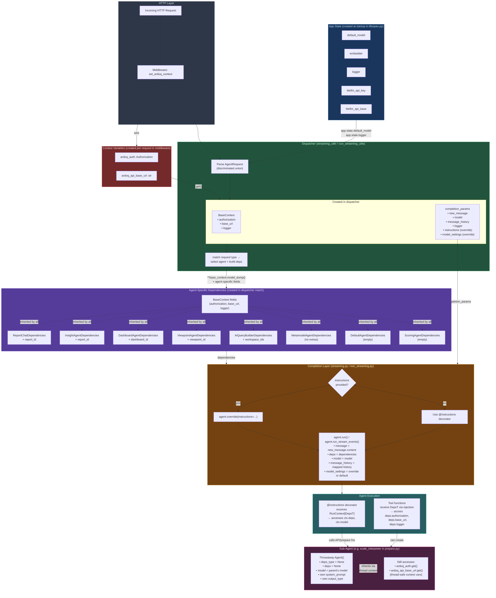
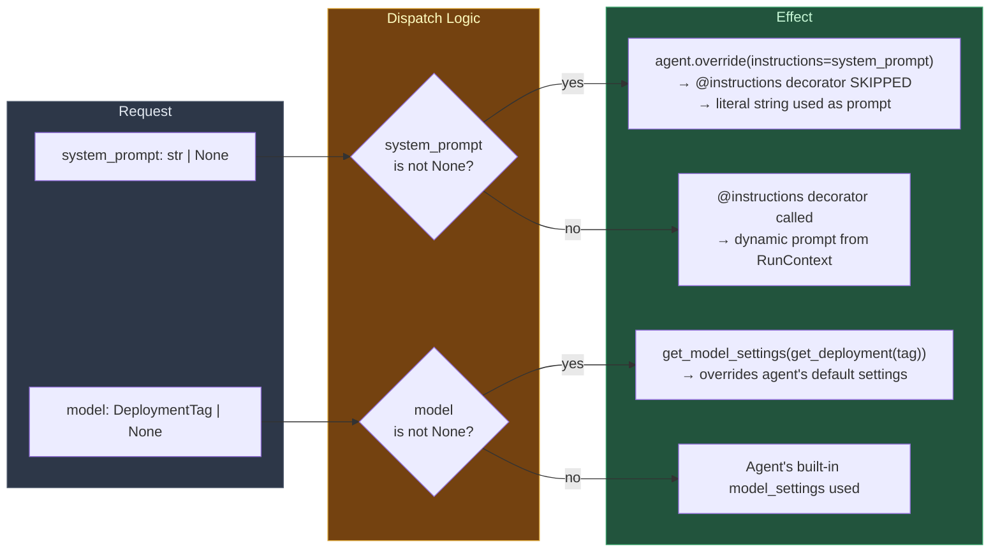

# Dynamic Agent Context Flow

How context variables are created and passed through the agent execution layers on the `AI-dynamically-return-agents` branch.

## Full Request Lifecycle

## Override Mechanism Detail

## Context Variables Summary

| Layer | Creates | Passes Down |
|-------|---------|-------------|
| **Lifespan (startup)** | `default_model`, `embedder`, `logger`, litellm keys | Stored on `app.state` |
| **Middleware** | `ardoq_auth`, `ardoq_api_base_url` (ContextVars) | Implicitly available via `.get()` |
| **Dispatcher** | `BaseContext`, `completion_params`, agent-specific `Dependencies` | `dependencies` + `**completion_params` to completion fn |
| **Completion fn** | `run_params` dict (mapped history, deps, model, settings) | All of `run_params` to `agent.run()` |
| **Agent execution** | `RunContext[DepsT]` (wraps deps + model ref) | `ctx.deps` to `@instructions` and tools |
| **Sub-agent** | Throwaway `Agent()` with `deps=None` | Reuses parent's `model`; reads ContextVars directly |

## Key Insight

Agents are **module-level singletons**, not factory-created. The "dynamic" part is:
1. **Dispatch-time selection** via `match` on request type
2. **Runtime override** of prompts/model via `agent.override()` context manager
3. **Dependency injection** — each request gets fresh `Dependencies` with request-scoped auth/context
4. **Sub-agents** inherit the model instance but NOT the dependency object; they rely on thread-safe ContextVars for auth
