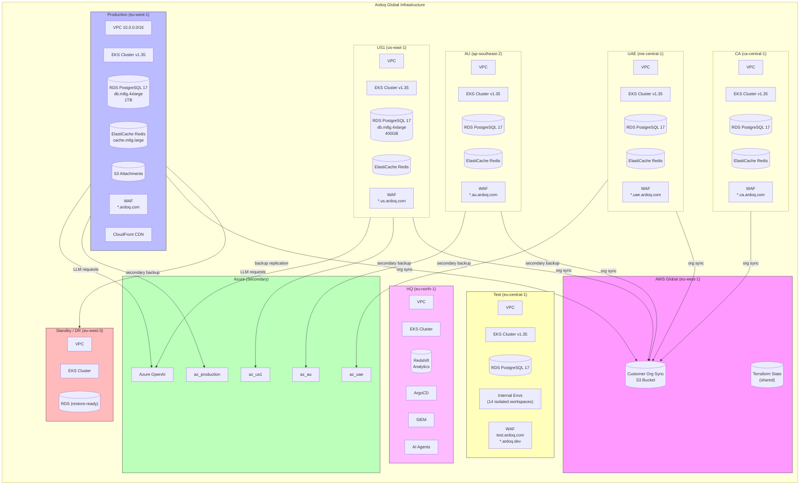
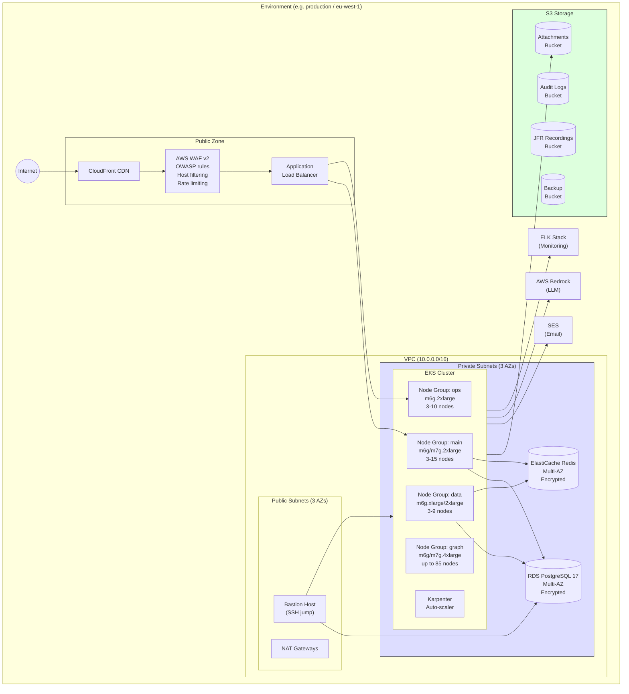
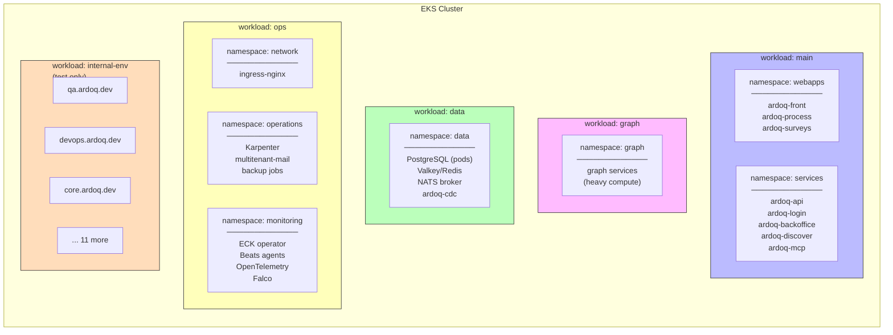
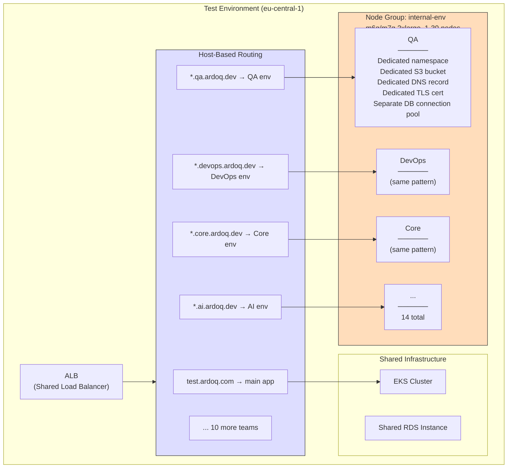
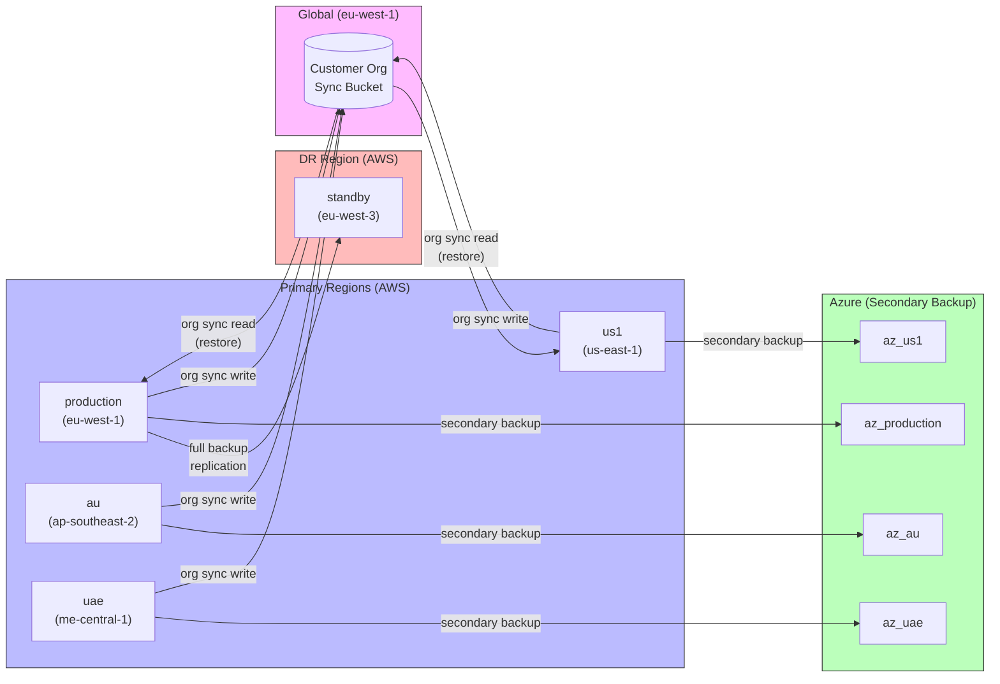
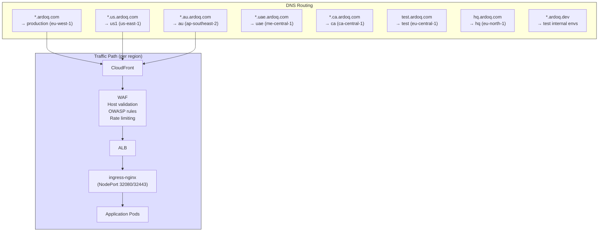
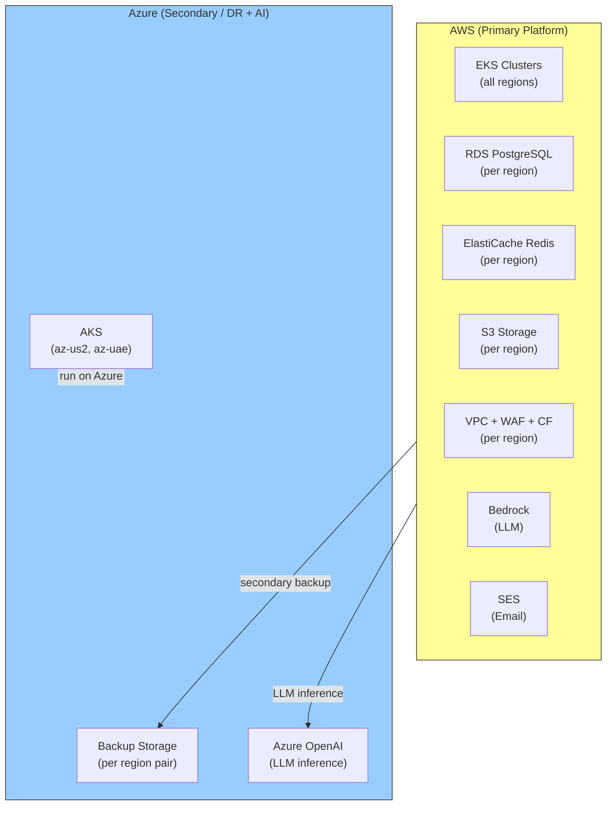
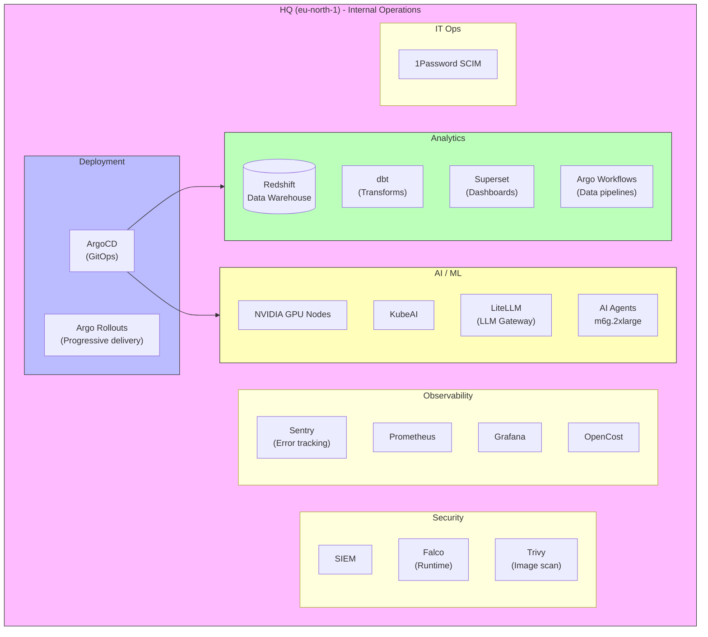

# Ardoq Infrastructure Architecture - Visual Guide

## 1. Global Multi-Region Overview

## 2. Single Environment Architecture (Per Region)

## 3. Kubernetes Workload Isolation (Node Groups)

## 4. Customer & Tenant Isolation Model

```mermaid
graph TB
    subgraph ISOLATION["Ardoq Tenant Isolation Strategy"]
        direction TB

        subgraph L1["Level 1: Region Isolation"]
            R_EU["EU Customers\n→ production (eu-west-1)"]
            R_US["US Customers\n→ us1 (us-east-1)"]
            R_AU["AU Customers\n→ au (ap-southeast-2)"]
            R_UAE["UAE Customers\n→ uae (me-central-1)"]
            R_CA["CA Customers\n→ ca (ca-central-1)"]
        end

        subgraph L2["Level 2: Infrastructure Isolation (per region)"]
            I_VPC["Dedicated VPC"]
            I_EKS["Dedicated EKS Cluster"]
            I_RDS["Dedicated RDS Instance"]
            I_REDIS["Dedicated Redis Cluster"]
            I_S3["Dedicated S3 Buckets"]
            I_WAF["Dedicated WAF Rules"]
        end

        subgraph L3["Level 3: Application-Level Multi-Tenancy"]
            A_ORG["Organization IDs\n(logical separation)"]
            A_DB["Database Users\nardoq_api_user\nardoq_customers_user\nardoq_grl_user\nardoq_shiftx_user\nardoq_cdc_user"]
            A_MAIL["Multitenant Mail\n(per-org routing)"]
            A_AUDIT["Per-Org Audit Logs"]
        end

        subgraph L4["Level 4: K8s Workload Isolation"]
            K_NODE["Node Group Separation\n(main/graph/data/ops)"]
            K_NS["Namespace Boundaries"]
            K_IRSA["IRSA: Pod → IAM Role\n(least privilege)"]
            K_PRIO["Priority Classes\n(critical/data/daemonset)"]
        end
    end

    L1 --> L2
    L2 --> L3
    L3 --> L4

    style L1 fill:#fdd,stroke:#c33
    style L2 fill:#ffd,stroke:#cc3
    style L3 fill:#dfd,stroke:#3c3
    style L4 fill:#ddf,stroke:#33c
```

## 5. Internal Environments (Test Cluster)

## 6. Backup & Disaster Recovery Flow

## 7. DNS & Traffic Flow

## 8. Multi-Cloud Strategy

## 9. HQ Environment (Internal Operations)

