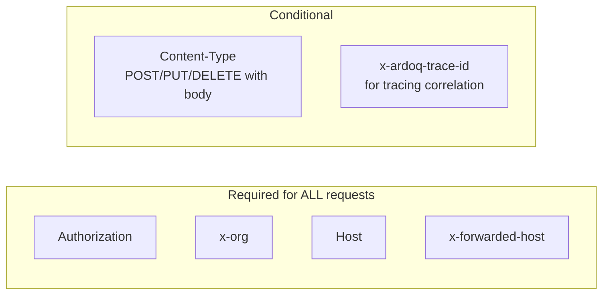

# Python Service API Headers

Minimal header requirements for the Python service calling the Ardoq API.

## Required Headers



## Header Reference

| Header | Required | Format | Example |
|---|---|---|---|
| `Authorization` | Always | `Token token=<token>` or `Bearer <token>` | `Token token=abc123...` |
| `x-org` | Always | Org label string | `my-organization` |
| `Host` | Always | Target hostname | `app.ardoq.com` |
| `x-forwarded-host` | Always | Target hostname | `app.ardoq.com` |
| `Content-Type` | With request body | `application/json` | `application/json` |
| `x-ardoq-trace-id` | For tracing | UUID v4 | `550e8400-e29b-41d4-a716-446655440000` |

> **Why set `Host` and `x-forwarded-host` manually?**
> - External requests (browsers) go through nginx, which handles these automatically.
> - Internal service-to-service calls bypass nginx and may use internal URLs (e.g., `http://api-service:8080`), so HTTP libraries set `Host` to the internal address, not the expected external hostname.
> - You must explicitly set both to the logical external hostname (e.g., `app.ardoq.com`).

## Python Example

```python
import uuid
import requests

class ArdoqClient:
    def __init__(self, base_url: str, token: str, host: str = "app.ardoq.com"):
        self.base_url = base_url
        self.token = token
        self.host = host  # External hostname for Host and x-forwarded-host
    
    def _headers(self, org: str, trace_id: str | None = None) -> dict:
        """Build headers for API request."""
        headers = {
            "Authorization": f"Token token={self.token}",
            "x-org": org,
            "Host": self.host,
            "x-forwarded-host": self.host,
        }
        if trace_id:
            headers["x-ardoq-trace-id"] = trace_id
        return headers
    
    def get(self, endpoint: str, org: str, trace_id: str | None = None):
        return requests.get(
            f"{self.base_url}{endpoint}",
            headers=self._headers(org, trace_id),
        )
    
    def post(self, endpoint: str, org: str, data: dict, trace_id: str | None = None):
        headers = self._headers(org, trace_id)
        headers["Content-Type"] = "application/json"
        return requests.post(
            f"{self.base_url}{endpoint}",
            headers=headers,
            json=data,
        )

# Usage - internal URL but external Host headers
client = ArdoqClient(
    base_url="http://api-service:8080",  # Internal service address
    token="adq_abc123...",
    host="app.ardoq.com",  # External hostname (or custom domain)
)
trace_id = str(uuid.uuid4())

# GET request
response = client.get("/api/workspace", org="my-org", trace_id=trace_id)

# POST request
response = client.post(
    "/api/component",
    org="my-org",
    data={"name": "New Component", "typeId": "p123"},
    trace_id=trace_id,
)
```

## Quick Reference

**Minimal GET request:**
```
GET /api/workspace HTTP/1.1
Host: app.ardoq.com
Authorization: Token token=adq_abc123...
x-org: my-organization
x-forwarded-host: app.ardoq.com
```

**Minimal POST request:**
```
POST /api/component HTTP/1.1
Host: app.ardoq.com
Authorization: Token token=adq_abc123...
x-org: my-organization
x-forwarded-host: app.ardoq.com
Content-Type: application/json
x-ardoq-trace-id: 550e8400-e29b-41d4-a716-446655440000

{"name": "Component", "typeId": "p123"}
```

## Response Headers to Capture

| Header | Purpose |
|---|---|
| `x-ardoq-trace-id` | Echo back for log correlation |
| `x-ardoq-org-label` | Confirms which org processed the request |

## Token Format

API tokens are 32-character hex strings (UUID without hyphens), optionally prefixed with `adq_`:

- With prefix: `adq_abc123def456...` (36 chars total)
- Without prefix: `abc123def456...` (32 chars)

Both formats are accepted. The `adq_` prefix is recommended for newer tokens.

## Common Mistakes

| Mistake | Fix |
|---|---|
| Missing `x-org` header | Always include — API cannot infer org for token auth |
| Missing `Host` header | Set explicitly to external hostname when calling internal URLs |
| Missing `x-forwarded-host` | Required for internal calls — nginx doesn't inject it |
| `Host` set to internal address | Override to external hostname (e.g., `app.ardoq.com`) |
| Wrong token format `Token <token>` | Use `Token token=<token>` (note the `token=`) |
| Missing `Content-Type` on POST/PUT | Add `Content-Type: application/json` |
| Invalid trace ID format | Must be valid UUID v4 string |
